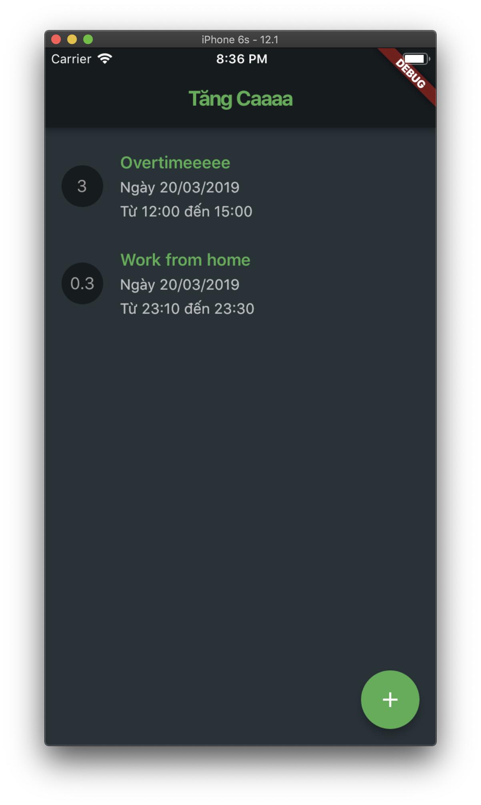
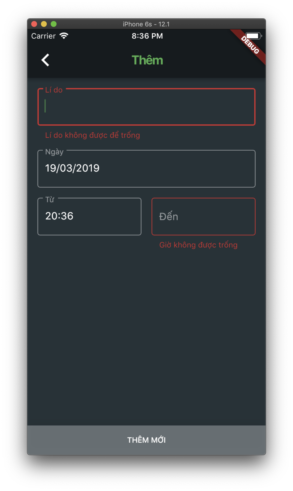
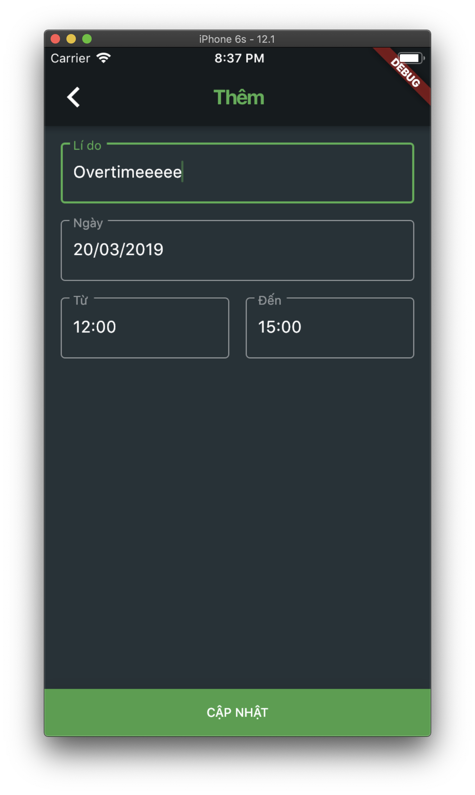
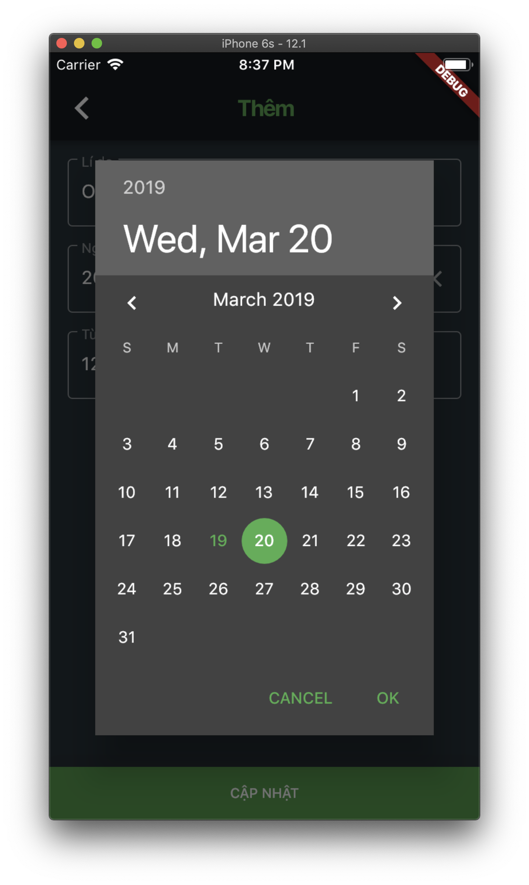

# Flutter Starter

A simple application written in Flutter to note your overtime work (OT)

## Features

- Base on [Flutter Starter](https://github.com/scitbiz/flutter-starter) with basic structure and scalable

- Using BloC pattern

- Simple, nice UI design

- Form validator example

- Swipe to dismiss example

## Screenshots

## Author

- scitbiz ([Github](https://github.com/nikhilpanju))

## Bugs/Requests

- If you encounter any problems feel free to open an issue. If you feel the project is missing a feature, please raise a ticket on Github. Pull request are also welcome.
